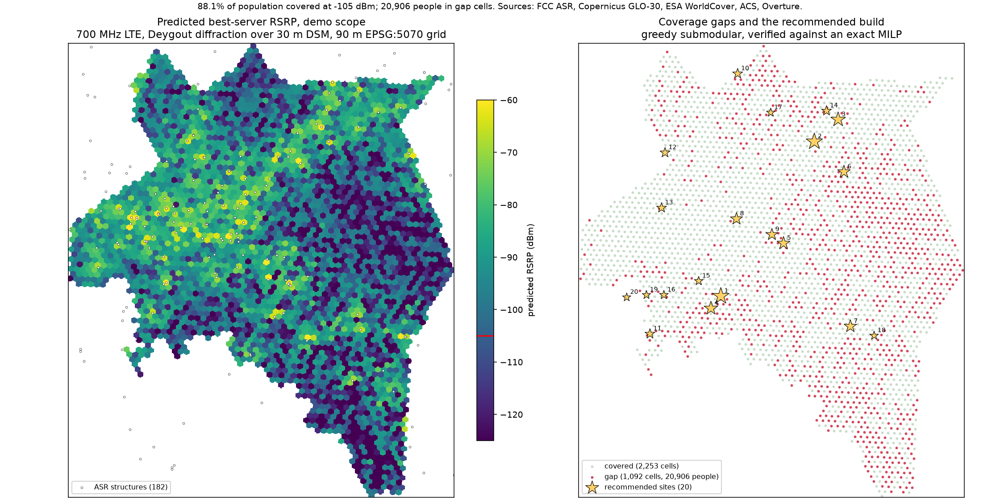
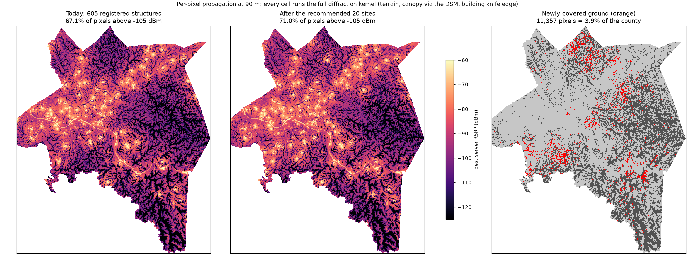
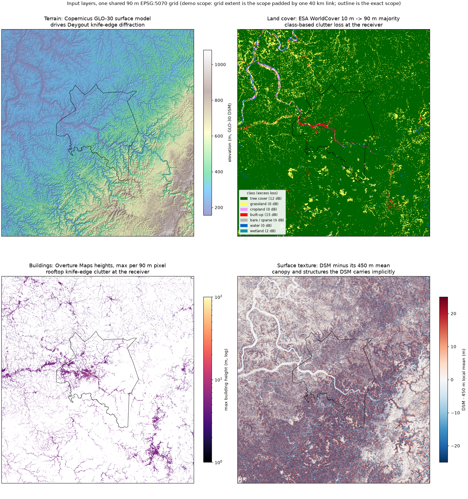
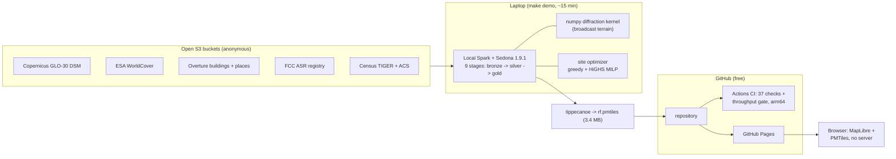
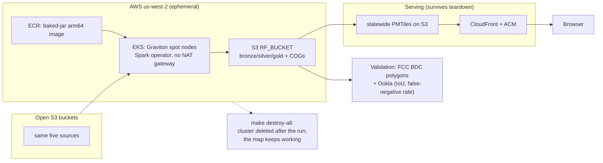

# sedona-rf-coverage

[](https://github.com/owensross27/sedona-rf-coverage/actions/workflows/ci.yml)

Modelling cellular coverage across West Virginia from open data, finding the
population it misses, and picking the tower sites that would close the most of
that gap.

Apache Sedona and Spark for the distributed geospatial work — vector joins and
tiled raster analytics both — a vectorized terrain-diffraction kernel for the
per-link physics, Kubernetes on EKS for the production run, and a static map
that stays up after the cluster is torn down.

> **Status.** The full local pipeline is real: `make demo` runs one county end
> to end from open S3 buckets to a ranked list of recommended tower sites,
> with a data-quality gate that exits non-zero. The statewide EKS run and the
> validation against FCC ground truth are in progress. Every number below was
> produced by a command in this repository; see [Verification](#verification)
> for exactly which gates pass.



**[Explore the interactive map](https://owensross27.github.io/sedona-rf-coverage/web/)** —
pan around, switch between signal / coverage / population / tree cover / relief,
and click any hexagon for why its signal is what it is: the serving tower and
its height, distance, line of sight, tree cover, terrain relief, and building
heights. One static PMTiles file served by GitHub Pages; no server anywhere.

## Headline result (demo scope: Kanawha County)

| Measure | Covered at -105 dBm RSRP |
|---|---|
| Receiver cells | 2,253 / 3,345 = **67.4%** |
| **Population** | **88.1%** (20,906 of 175,206 people in gap cells) |
| Demand (population + growth + tourism) | 89.0% |

Two coverage numbers on purpose: they differ by more than twenty points on the
same run, because the gaps are rural and rural cells hold fewer residents
each. A coverage figure that does not say whether it is cell-weighted or
population-weighted is not a number, and the easiest way for a study like this
to mislead is to quote whichever one flatters. `tests/test_coverage.py` pins
the distinction.

What actually distinguishes a gap cell, measured per hexagon by Sedona zonal
statistics over the input rasters (stage 08):

| Feature (per-cell mean) | Gap cells | Covered cells |
|---|---|---|
| Terrain relief within the cell | 156 m | 130 m |
| Tree-cover fraction | 0.97 | 0.91 |
| Built-up fraction | 0.00 | 0.03 |

The gaps are steep, forested, and essentially uninhabited by structures —
which is also why the population-weighted number is so much higher than the
cell-weighted one.



The hexagons are the analysis unit; the picture above is the same physics at
every 90 m pixel (`make surface`, ~100M links in one Spark pass): today's
best-server RSRP, the surface after the optimizer's 20 recommended sites, and
the ground those sites newly cover. Per-pixel coverage lands at 67.1% against
the hex grid's 67.4% — two receiver sets, one model, same answer. Both
surfaces are also toggleable layers in the interactive map.

## Why West Virginia

The hardest terrain in the eastern United States, some of the worst mobile
coverage, and three things that make the siting problem more interesting than
a population raster:

- **The National Radio Quiet Zone.** A 13,000 square mile federal zone around
  the Green Bank Observatory where new transmitters require coordination. It
  is a real legal constraint on where a tower can go, and the optimizer treats
  it as one — candidates inside it are flagged, never silently dropped.
- **Population moving in two directions at once.** The Eastern Panhandle is
  growing as a DC exurb while the southern coalfields decline. A single
  statewide growth figure would hide both.
- **Demand without residents.** New River Gorge, Snowshoe, the Hatfield-McCoy
  trail system. A trailhead has no population and real demand, which is why
  tourism enters the demand score additively rather than as a multiplier.

## The model

```
RSRP = EIRP - 10*log10(subcarriers) - FSPL - L_diffraction - L_clutter - shadow margin
```

700 MHz low-band LTE, the band that actually carries rural coverage.
Free-space loss, plus Deygout three-edge knife-edge diffraction over a
128-sample terrain profile with an effective-earth correction for atmospheric
refraction, plus a receiver clutter term. Covered means RSRP at or above
**-105 dBm** — the FCC Broadband Data Collection's own 4G LTE reference value,
so validation compares like with like instead of against a threshold of our
choosing. The full budget derivation is in
[`docs/link-budget.md`](docs/link-budget.md).

The clutter term is the maximum of two descriptions of whatever stands next
to the receiver, never their sum:

- **Land-cover class** (ESA WorldCover): a pre-registered flat loss per class
  — 12 dB tree cover, 15 dB built-up, and so on.
- **Building height** (Overture Maps): the receiver stands half a street width
  behind a rooftop of the pixel's tallest measured building, and the loss is
  the same ITU-R P.526 knife edge the terrain model uses. One physics, two
  obstruction sources.

The building term was added after the first results existed, and the change is
governed by the pre-registration rule rather than exempt from it: the forcing
measurement (Overture carries `height` on 74% of West Virginia's 4.55M
building footprints) is recorded in `config.yml`, the flat-class baseline is
retained behind one switch and reproduces bit for bit
(`test_no_building_layer_reproduces_the_baseline_exactly`), and both results
are reported in [`docs/validation.md`](docs/validation.md). The check that
makes it a refinement rather than a re-tune: the median WV building (3.55 m)
evaluates to **14.8 dB** against the flat 15 dB the built-up class
pre-registered — two independent routes to the same street.

| | Cells covered | Population covered | Median served RSRP |
|---|---|---|---|
| Class-based clutter (pre-registered baseline) | 67.8% | 89.3% | -88.6 dBm |
| + building heights (current model) | 67.4% | 88.1% | -89.5 dBm |

Every parameter is pre-registered in [`config.yml`](config.yml) with the
reasoning attached, committed before any result was computed. Parameters
changed after results existed carry the measurement that forced them, in the
file and in the commit.



## Architecture

```
open S3 buckets                     this pipeline                        output
───────────────                     ─────────────                        ──────
Copernicus GLO-30 DSM ─┐
ESA WorldCover 10 m   ─┼─ 02_terrain  → DEM + clutter + building COGs ─┐
Overture buildings    ─┘               one 90 m EPSG:5070 grid          │
FCC ASR registry      ─── 01_towers   → GeoParquet towers               ├─ 05_links
TIGER + ACS           ─── 03_census   → block groups + population       │  ST_DWithin
Overture places       ─── 04_grid     → H3 r8 receivers + demand      ─┘  + numpy
                                                                          kernel
                                                                            │
              06_coverage  ← best server per receiver, gaps, RSRP COG ──────┘
                   │
      ┌────────────┼────────────────┐
  07_dq        08_features       09_siting
  gate,        Sedona raster:    greedy + exact MILP,
  exit != 0    zonal stats,      NRQZ-flagged
               gap-mask COG
```

`make demo` runs all nine stages on a laptop with local Spark and no AWS
account. The same code runs statewide on EKS by changing `SCOPE`.

### Deployment: what runs today

Everything below is built, running, and verified. Nothing here touches a paid
service — total spend to date is $0.00.



### Deployment: the statewide plan (not yet built)

The same code at `SCOPE=state` on EKS. Design decisions are made and costed
(~$21 modelled, worst case ~$35 — see [Cost](#cost)); no cloud resource
exists yet, and this diagram is a plan, not a claim.



The teardown box is the design's central claim: the cluster is a compute
appliance, not infrastructure. The public map must not notice its absence.

### Where Sedona does the work

Two different jobs, and the split is the architecture claim of the repo:

**Vector.** Pair generation is the genuinely hard distributed problem:
registered structures against H3 receiver cells is 425 million combinations
as a cross join at state scope. `ST_DWithin` over EPSG:5070 metres with a
spatial index behind it turns that into a few million, in both the coverage
pass (05) and the candidate evaluation of the site optimizer (09). GeoParquet
in and out everywhere; the geometry-bearing tables never leave Sedona types.

**Raster.** Stage 08 answers ~3k (demo) to ~85k (state) zonal questions —
relief, forest fraction, building height per receiver cell — as tiled raster
analytics: `RS_TileExplode` the COGs, spatial-join hexagons to tiles with
`RS_Intersects`, `RS_ZonalStatsAll` per intersection, and aggregate the
combinable statistics per hexagon. Land-cover masks are `RS_MapAlgebra` over
the clutter tiles, and the uncovered-area mask is computed and encoded
entirely inside Sedona (`RS_MapAlgebra` → `RS_AsCOG`) without ever becoming a
numpy array. Measured: 5 tiled rasters x 3,345 hexes in **18.9 s** on four
local cores, and the plan is unchanged on the cluster. A three-hex sample is
independently recomputed with rasterio and asserted to agree.

### Where it deliberately does not

The per-link physics runs in numpy on broadcast arrays, not through
`RS_Value`. The obvious implementation explodes each pair into its terrain
samples and looks each one up through the JVM boundary: ~380 million calls at
state scope. Instead the DEM, clutter and building rasters are broadcast once
(10 MB measured at demo scope; ~80 MB projected statewide) and every sample is
a fancy index into shared read-only RAM. Measured at **9.4M pairs/min/core** —
94x the go/no-go gate ([`docs/benchmarks.md`](docs/benchmarks.md)).

Same engine, opposite choices, each with the measurement that justifies it:
tiled raster SQL for thousands of zonal questions, broadcast arrays for
hundreds of millions of point samples.

## Site selection

The maximum-coverage location problem, solved twice on purpose:

- **Greedy submodular** — take the largest marginal gain, twenty times.
  Guaranteed within 1-1/e (63.2%) of optimal; milliseconds.
- **Exact MILP** through HiGHS (`scipy.optimize.milp`) — proves the optimum,
  or proves how close greedy already was.

Demo scope: greedy landed at **99.8% of the proven optimum** in 0.01 s. The
textbook bound is nowhere near binding on real geography, and that is an
argument you can only make by running both solvers.

Candidates are existing ASR structures within 15 km of a gap (colocation is
what carriers actually do) plus the highest DEM pixel in each r7 cell
containing a gap. Both are evaluated with the full propagation kernel — the
optimizer and the coverage map run identical physics by construction, because
stage 09 imports stage 05's kernel rather than restating it.

Two results worth more than the site list itself:

- **The reachable ceiling.** Twenty sites reach 150 of 1,092 gap cells, which
  reads as a feeble optimizer until you know that *all 369 viable candidates
  together* reach only 946 — the remaining gaps are unreachable at this link
  budget from any candidate. Against that ceiling, twenty towers capture
  **84%** of the recoverable demand.
- **The plan is a tourism plan, and the pre-registered sensitivity proves
  it.** Re-solving under `tourism_weight` in {0, 1000, 3000} shares
  {3, 20, 19} of 20 sites with the published plan: robust to the magnitude of
  the tourism term, entirely dependent on counting tourism at all. Seventeen
  of the twenty recommended sites exist because a trailhead counts. That is a
  defensible, pre-registered modelling position — but it is the kind of fact
  a reader should be told, not discover.

## Two bugs worth reading about

Both were caught by the test suite before any map was drawn. They are written
up because the failure mode they share — a model that produces a beautiful,
confident, wrong picture — is the one that matters in this domain.

**Phantom diffraction over flat ground.** The first kernel searched for the
strongest Fresnel obstruction across every profile sample. A receiver 1.5 m
above flat ground has about 3 m of clearance against an 8 m first-Fresnel
radius at 5 km, so the ground immediately beside it always registered as an
obstruction — and Deygout charged for it three times, principal edge plus both
sub-path edges. Measured result: **11.4 dB of diffraction loss across
dead-flat terrain**, on every link in the state, which would have inflated the
headline uncovered-population figure. Diffraction is now restricted to terrain
that actually rises above the geometric ray.

**A test that was wrong, not the code.** A link-budget test asserted that a
40 km free-space link lands just above threshold. It came out 19 dB lower.
The kernel was right: at 40 km a 50 m mast is *beyond the radio horizon* of a
1.5 m handset (sqrt(2kRh) ≈ 29 km + 5 km ≈ 34 km), so the earth's own
curvature obstructs the path. The test was replaced with one that verifies the
line-of-sight flag flips at the computed horizon.

## Reproduce it

```bash
make setup   # uv venv, python 3.11, pinned pyspark 3.5.3 + sedona 1.9.1
make test    # 37 correctness checks, no framework, no network
make bench   # throughput gate
make demo    # one county end to end, local Spark, writes to ./data
make map     # the two figures above, from your own run's outputs
```

`make demo` needs one free credential: a Census API key
(api.census.gov/data/key_signup.html) in a `.env` file as
`CENSUS_API_KEY=...`. Everything else reads anonymous open S3 buckets.
**No AWS account, no cloud spend.** If `make demo` stops working, the repo is
not reproducible and that is a bug.

The cloud tier is opt-in and needs `RF_BUCKET` and `AWS_ACCOUNT_ID` exported;
no account identifier appears anywhere in this repository.

## Running Sedona on Kubernetes

There is no official Sedona Kubernetes image, no Helm chart, and no guide. The
`apache/sedona` image on Docker Hub is explicitly a single-node dev/demo
build. `docs/eks-runbook.md` (written alongside the statewide run — see
[Verification](#verification)) documents the gap and ships a working answer.
The parts that cost real time:

- **Sedona must be 1.9.1, not 1.9.0.** 1.9.0 carries a `ST_Transform`
  regression over 180 m (GH-3161) that silently corrupts reprojection. This
  pipeline reprojects every tower and DEM tile.
- **`spark-defaults.conf` baked into an image does nothing on Kubernetes.**
  Spark generates a ConfigMap from the submit-time config and mounts it over
  `SPARK_CONF_DIR`, shadowing the image's copy. s3a settings have to be set in
  the `SparkConf` builder — see [`src/session.py`](src/session.py).
- **Anonymous open-data reads and authenticated writes in one session.** A
  global anonymous provider breaks the writes; the default chain breaks the
  public reads. Per-bucket overrides are the only correct answer, and a typo
  in a bucket name there fails as a 403 that looks exactly like a missing
  object.
- **PySpark's memory overhead factor is 0.4, not 0.1.** `memory: 24g` requests
  ~33.6 GiB. Size against node allocatable or pods sit Pending.
- **arm64 end to end.** Graviton measured ~35% cheaper on spot, and building
  natively on Apple Silicon removes QEMU from the iteration loop. `make
  preflight` asserts every third-party image publishes arm64 before a pod can
  fail with `exec format error`.

## Cost

**Spend to date: $0.00.** Every input is an anonymous open S3 bucket and the
whole demo pipeline runs locally.

The statewide cloud run is modelled from live us-west-2 spot prices (measured
2026-08-09, labelled modelled until a real run replaces it) at about **$21**,
worst case ~$35. The same architecture with eksctl's default NAT gateway, a
load balancer, and the cluster left up for a week runs about $115 — the saving
is architectural, not disciplinary:

- NAT gateway **disabled** (public subnets + IGW reach ECR and S3 for free)
- single-AZ nodegroups (no cross-AZ shuffle at $0.01/GB each way)
- no load balancer and no ingress controller (NodePort behind CloudFront)
- **the public map does not depend on the cluster**, so there is never a
  reason to leave it running

`make status` reports month-to-date spend and asserts no NAT gateway exists;
`make destroy-all` tears down the cluster, the Terraform resources, and scans
for orphaned EBS volumes.

## Evaluated and rejected

| Choice | Why not |
|---|---|
| Karpenter / cluster-autoscaler | Two known workload shapes, ~20 hours total. An hour of IAM setup that saves nothing and adds a demo-day failure mode. |
| ALB or NLB | ~$17/mo plus a controller install, to expose one NodePort that CloudFront already fronts. |
| martin / pg_tileserv | Both exist to serve tiles from PostGIS. PMTiles serves the same tiles as one static file with no database in the path. |
| Iceberg | No schema-evolution or incremental-refresh requirement; outputs are COGs and GeoParquet that a browser and DuckDB read directly. |
| IRSA | hadoop-aws 3.3.4 pairs with AWS SDK v1, making web identity an hour of yak-shaving for ~zero security delta on an ephemeral single-tenant cluster. Documented as the production upgrade. |
| cert-manager + Let's Encrypt | LE allows 5 duplicate certificates per week; this cluster is recreated 6-10 times in a fortnight. ACM is free and does not rate-limit. |
| Overture `num_floors` | Present on 0.5% of WV buildings — unusable. `height` is present on 74% and is used (see the clutter model above). An earlier note here dismissed the whole theme as sparse; measuring it corrected that. |
| Hata / COST-231 path models | Invalid past ~20 km; West Virginia links routinely exceed that. (COST-231's rooftop-to-street *bound* does inform the building-loss cap.) |
| Wherobots Cloud | No free tier as of 2026-08-09 (trial only), so the deployment story had to be self-hosted. |

## Limitations

Stated up front rather than discovered by a reader. The quantified ones are in
[`docs/validation.md`](docs/validation.md).

- **FCC ASR structures are not cell sites.** The registry covers structures
  over 200 ft, includes broadcast masts, and misses rooftop and small-cell
  installations entirely. Reconciling ASR against FCC BDC coverage polygons —
  to infer which structures plausibly carry cellular — is planned as a
  published output, because the weakest input makes the most interesting
  finding.
- Isotropic transmitters: no antenna patterns, downtilt, sectorization, or
  per-carrier equipment data. Every structure is assumed to transmit at one
  pre-registered EIRP.
- Clutter is evaluated at the receiver pixel only, not integrated along the
  path. Mid-path forest enters only through the surface model's canopy.
- GLO-30 is a *surface* model: canopy and large buildings are partly in the
  terrain profile and partly in the clutter term. The overlap is bounded and
  documented, not zero.
- No interference, no capacity modelling, no building penetration.
- Deygout over-predicts loss when several edges are of similar prominence —
  used anyway because the single-knife-edge alternative *under*-predicts in
  multi-ridge terrain, and the direction of error that flatters the result is
  the one to avoid.

## Verification

| Gate | Status |
|---|---|
| Kernel correctness (`make test`) | **37/37 passing** — physics anchors (J(0)=6.02 dB, radio horizon, flat ground costs nothing), coverage weighting, optimizer-vs-MILP on a known instance |
| Kernel throughput (`make bench`) | **passing, 94x margin** |
| `make demo`, one county end to end | **passing, exit 0** — nine stages, ~15 min on a laptop |
| DQ gate fails non-zero on bad input | **verified both ways** — tampered thresholds exit 1 naming the failed checks |
| Building-height model vs pre-registered baseline | **reported side by side**, baseline reproducible bit for bit |
| Sedona zonal stats vs independent rasterio recompute | **agrees** (asserted in stage 08) |
| Model vs FCC BDC and Ookla | not yet — the next milestone |
| Statewide run on EKS | not yet |

## Data

All open, all cloud-native, all verified live. Full catalogue with S3 URIs
and licences: [`docs/data-sources.md`](docs/data-sources.md).

Copernicus GLO-30 DSM · ESA WorldCover 10 m (CC BY 4.0) · Overture Maps places
and buildings (CDLA Permissive 2.0 / ODbL) · FCC Antenna Structure
Registration (public domain) · FCC Broadband Data Collection · Ookla Open Data
(CC BY-NC-SA 4.0, non-commercial) · US Census TIGER/Line and ACS 5-year
(public domain).

There is no public GeoParquet of TIGER block groups anywhere, so this pipeline
makes one.

## Licence

Apache-2.0. See [LICENSE](LICENSE).
